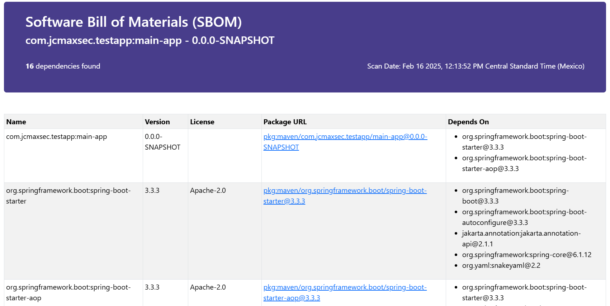
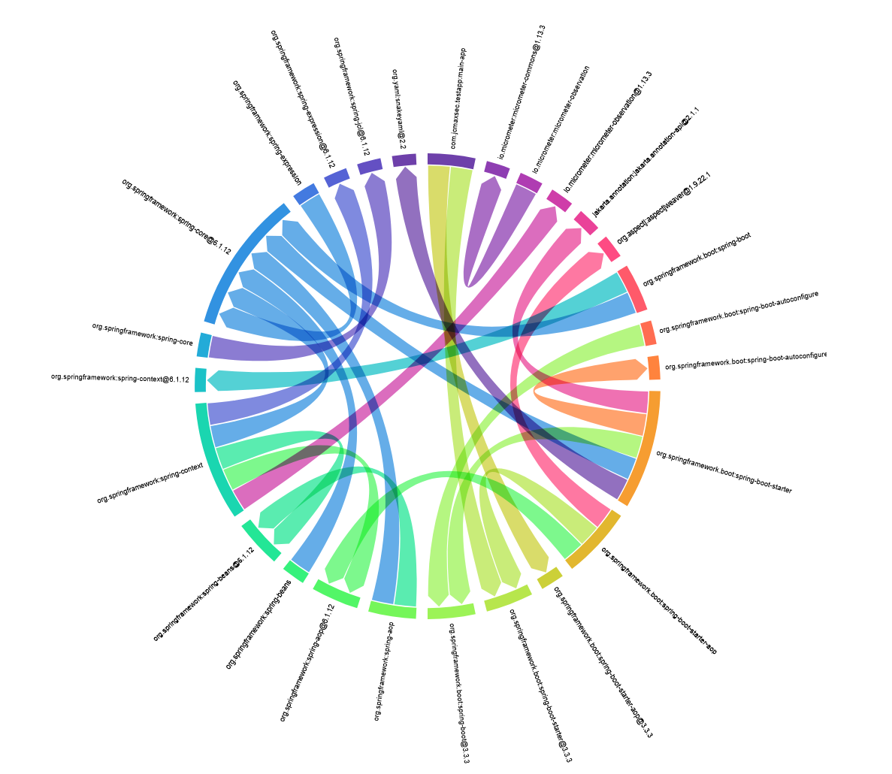

# sbom-to-html
This tool takes SBOM in JSON format and creates an HTML report with a dependency table and a dependency chart to help visualize your software dependencies. It currently supports the following formats:
- [CycloneDX](https://cyclonedx.org/) 1.4, 1.5 and 1.6
- [SPDX](https://spdx.dev/) 2.3

## Requirements
- [Python 3](https://www.python.org/).
- [Bootstrap 5](https://getbootstrap.com/). (Optional) Is used to beautify HTML code (included via CDN reference in report template).
- [D3.js](https://d3js.org/) (Optional) JavaScript visualization library to create dependency chart (included via CDN reference in report template). 
  
## Installation
Clone the repository to your computer using the following command:
```shell
git clone https://github.com/jcmaxsec/sbom-to-html.git
```

## Usage

```shellSession
$ pyton sbom-to-html.py -h

usage: sbom-to-html [-h] [-i SBOM_FILE] [-o HTML_OUTPUT_FILE] [-rt REPORT_TEMPLATE] format

Generate HTML report out of SBOM Json file

positional arguments:
  format                CycloneDx1.4, CycloneDx1.5, CycloneDx1.6 and SPDX2.3 are supported, others versions might work

options:
  -h, --help            show this help message and exit
  -i SBOM_FILE, --sbom-file SBOM_FILE
                        SBOM input file (default: sbom.json)
  -o HTML_OUTPUT_FILE, --html-output-file HTML_OUTPUT_FILE
                        HTML output file (default: sbom.html)
  -rt REPORT_TEMPLATE, --report-template REPORT_TEMPLATE
                        HTML template file (default: report-template.html)

Licence CC BY. Use it freely and please contribute https://github.com/jcmaxsec/sbom-to-html :)```
```

## Examples
The output report looks like this:





You can also download a [Sample Report](assets/sbom-report-cyclonedx-1.6.html) to have a better idea of how your report would look like.

## Advanced
### Changing the report format
The report is based on a simple HTML template (no templating engine used) that you can modify the code to change the format and styles. Check [report-template.html](report-template.html) for the default template. You can duplicate the file and call the script adding '-rt=mytemplate.html' as an option.

Notice however that if you need additional information to be included, you will have to modify the CycloneDX and SPDX processor modules to achive your goal.

## Having Issues?
Contact me via [@jcmaxsec](https://x.com/jcmaxsec) I will try to help, remember, this is an open source softwate so feel free to improve it.
